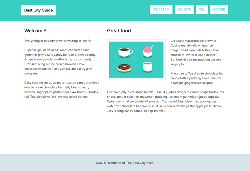
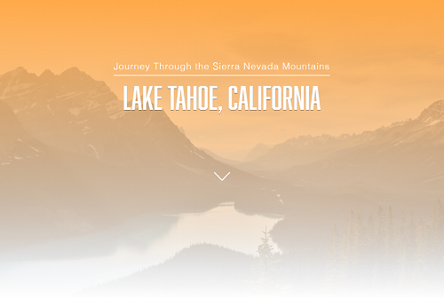

# My Treehouse Portfolio

Some completed challenges from my *Front-End Web Developer Track* on [Treehouse](https://teamtreehouse.com/).

## Best City Guide

Responsive web layout using the CSS `float` property. [Go to page](https://luisgerardodev.github.io/treehouse-portfolio/css-floats/).

## Lake Tahoe, California

Responsive landing page layout using background image with a color overlay. [Go to page](https://luisgerardodev.github.io/treehouse-portfolio/css-shadows/).