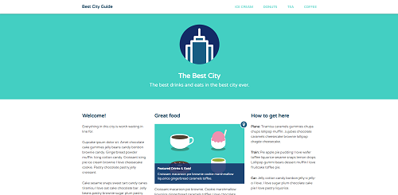

# My Treehouse Portfolio

Some completed challenges from my _Front-End Web Developer Track_ on [Treehouse](https://teamtreehouse.com/).

## JavaScript and the DOM - Interactive List

Making a web page interactive using the __JavaScript__ to toggle between showing or hiding a list. Add, remove and move `<li>` elements. [Go to page](https://luisgerardodev.github.io/treehouse-portfolio/js-list/).

## Best City Guide

Responsive web layout using the CSS `float` property. [Go to page](https://luisgerardodev.github.io/treehouse-portfolio/css-floats/).

## Best City Guide 2 (fixed nav)

Responsive web layout using the CSS `float` and `position` properties. [Go to page](https://luisgerardodev.github.io/treehouse-portfolio/css-position/).

## Lake Tahoe, California

Responsive landing page layout using background image with a color overlay. [Go to page](https://luisgerardodev.github.io/treehouse-portfolio/css-shadows/).
